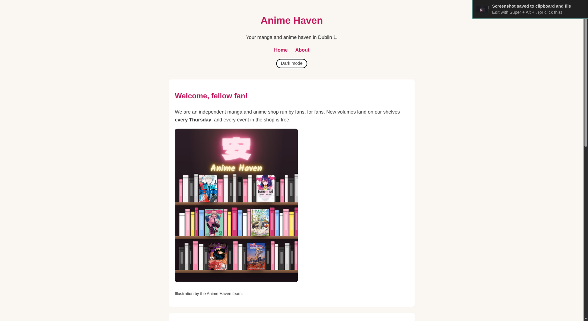
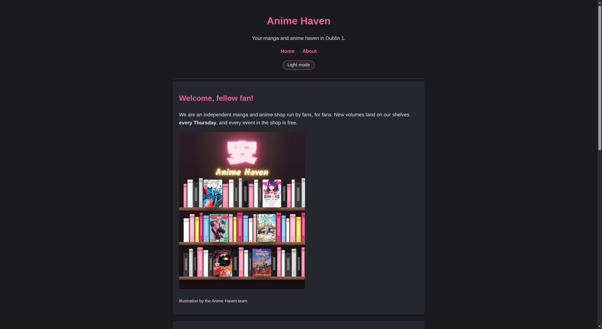

# WebDev_Project_Sofia

Website for AnimeHaven, a manga and anime shop in Dublin. Built for CMPU 1031 Web Development 1.

 

## The aim

This project is meant to be a simple yet effective way for anime fans all across Ireland to purchase whatever they may need relating to anime and also take part in community events.

## What's on the site

- **Home page:** a welcome section, this week's new releases, the most popular series and upcoming shop events.
- **About page:** the story of the shop and its owner Sofia, what we sell, the address and opening hours.
- **Light/dark mode:** a button in the header switches the colours. It remembers your choice and uses your computer's setting the first time you visit.
- **Small screens:** the layout and images shrink to fit phones.

## Running it

There's nothing to install. Clone the repo and open `index.html` in a browser.

```
git clone <repo url>
```

## Files

```
index.html   home page
about.html   about page
style.css    all the styling, including the light and dark colours
theme.js     the light/dark switch
images/      pictures used on the pages
screenshots/ pictures used in this README
```

## Built with

- HTML
- CSS (including variables for the two colour themes)
- A little plain JavaScript for the theme button

## What I practiced

- Writing semantic HTML (`header`, `nav`, `main`, `section`, `footer`)
- Styling with CSS selectors, the box model (padding, margin, border) and `:hover`
- Using CSS variables so one set of rules can work for two colour themes

## Credits

All images are illustrations by the (fictional) AnimeHaven team. The shop, its books and its events are made up for this course project.
